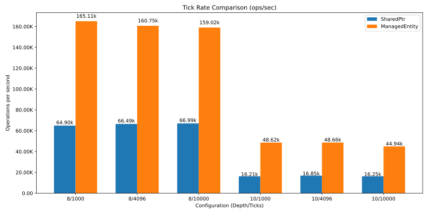
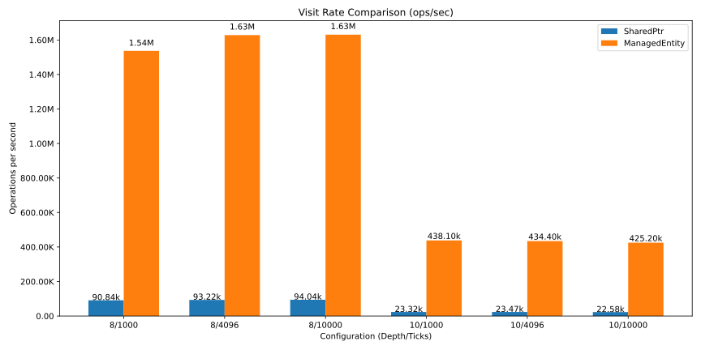
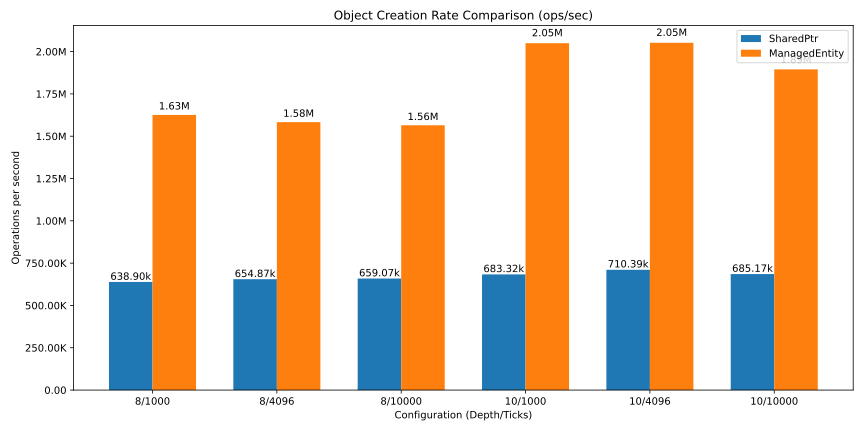

# PoC - C++ Inside Out Objects

This is an experiment on immutable data storage for C++ inspired on
the Perl approach called "inside-out objects", where the object has
its memory stored in a separate storage from the object itself,
allowing better memory access patterns.

The idea of bringing this to C++ comes from reflections on Data-Driven
design, and also after some early experiments with using shared points
that made me realize that the reference count being close to the data
itself means that we end up introducig a lot of page-faults on
unrelated threads.

The target use case for this proof of concept is on situations where
we are representing the data in the system as a series of "frames",
this is particularly relevant on the context of games. In situations
like this, it's possible to think about the data in a "transactional"
way. Meaning that all threads committing changes to the data will do
so atomically, and that every thread reading the data should be
presented with a fully immutable data representation.

The fact that we will allocate data for a final immutable struct type
in a fixed-size array means that memory fragmentation will not become
an issue over time, as any item that is deallocated leaves the perfect
hole for a new item to be allocated.

Since this scenario usually involves situations where the ownership is
shared, the smart pointer class also implements a reference count, but
instead of holding the reference itself, we presume that most places
will be looking at the reference, not making copies of it, which means
very few places need to touch the memory with the refcount, such that
the pages being loaded are all truly immutable, which should be a
significant benefit for a multi-threaded environment.

## Benchmarks

There's a benchmark in this repo that compares rapidly changing data, in
an system with a producer thread and a consumer thread, such as what you
would see in a game where the entire game state is represented as a tree
of immutable objects.

The results are actually quite interesting.

## Benchmark Results

| Depth/Ticks | Tick/s (SharedPtr) | Tick/s (ManagedEntity) | %-Change (Tick/s) | Visit/s (SharedPtr) | Visit/s (ManagedEntity) | %-Change (Visit/s) | Objects/s (SharedPtr) | Objects/s (ManagedEntity) | %-Change (Objects/s) |
|-------------|--------------------|-----------------------|-------------------|---------------------|-------------------------|--------------------|----------------------|--------------------------|----------------------|
| 8/1000 | 64.90k | 165.11k | +154.43% | 90.84k | 1.54M | +1591.73% | 638.90k | 1.63M | +154.43% |
| 8/4096 | 66.49k | 160.75k | +141.76% | 93.22k | 1.63M | +1646.94% | 654.87k | 1.58M | +141.76% |
| 8/10000 | 66.99k | 159.02k | +137.38% | 94.04k | 1.63M | +1634.17% | 659.07k | 1.56M | +137.38% |
| 10/1000 | 16.21k | 48.62k | +199.96% | 23.32k | 438.10k | +1778.93% | 683.32k | 2.05M | +199.96% |
| 10/4096 | 16.85k | 48.66k | +188.85% | 23.47k | 434.40k | +1751.06% | 710.39k | 2.05M | +188.85% |
| 10/10000 | 16.25k | 44.94k | +176.54% | 22.58k | 425.20k | +1782.88% | 685.17k | 1.89M | +176.54% |

## Benchmark Charts

### Tick Rate Comparison

### Visit Rate Comparison

### Object Creation Rate Comparison

